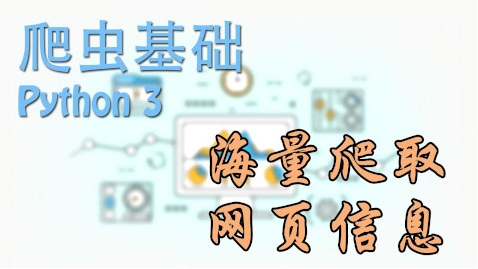

# Python-Study

本仓库旨在记录本人在进行python学习中的一些收获。希望同时也能帮到其他人。

也可以将本仓库看成Python学习资源推荐仓库。:)

## 目录结构

### crawler

学习**[莫烦PYTHON-Python3爬虫基础](https://morvanzhou.github.io/tutorials/data-manipulation/scraping/)**课程中的练习代码

### csp

> **CCF CSP认证（**CCF计算机软件能力认证 Certified Software Professional**）**
>
> 中国计算机学会（CCF）联合华为、360、滴滴等十余家知名IT企业以及清华、北航、国防科大等15所著名高校于2014年推出CCF CSP（计算机软件能力）认证标准，用于评价业界人士的计算机软件能力。
>
> 截至2019年3月，CCF CSP认证在全国57个城市的126所院校设立了认证点，每年举办三次。目前，CCF已成功举办16次CSP认证，来自全国400余所单位的98599人参加了认证。

`csp`目录记录已完成的[CSP](http://cspro.org/)往年试题的解题代码

### just_for_fun

> "实践出真知"

无聊写的一些小代码。有啥新奇的小想法，不要错过，尝试着去实现。

### mooc

>国家精品在线开放课"Python语言程序设计"(中国大学MOOC平台)对应的实践课程，第11次开课。

课程链接：[中国大学MOOC](https://www.icourse163.org/course/BIT-268001) [Python123](https://python123.io/index/courses/1521)

记录平常课后习题和测验的代码:

- `examinations` 目录下为测验题代码

- `exercises` 目录下为练习题代码

### old

不知道从哪里找来的自学视频

### python_book

记录学习**《Python编程：从入门到实践》**过程中的相关代码。

**强烈推荐这本书！** 图书链接： [中文版](https://www.ituring.com.cn/book/1861)|[英文版](https://www.amazon.cn/dp/B07J4521M3)